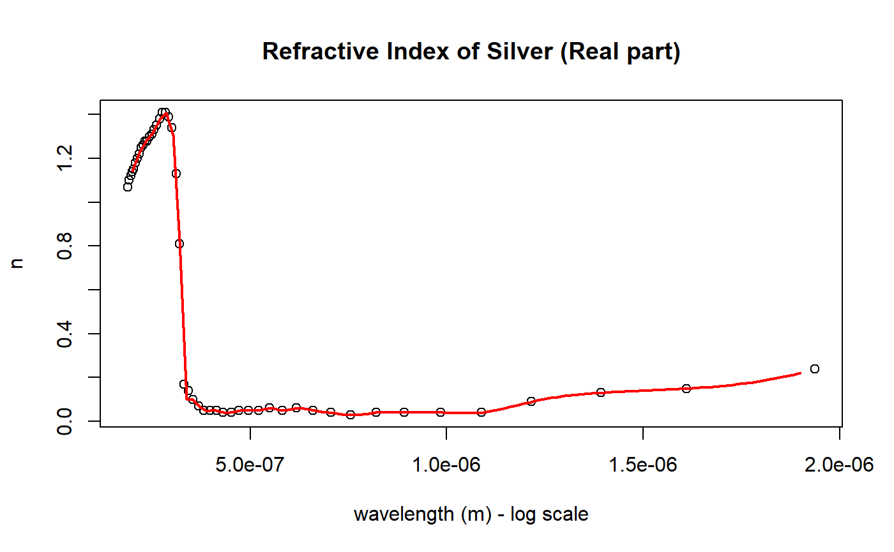

<!-- README.md is generated from README.Rmd. Please edit that file -->
rindex
======

The goal of rindex is to provide access to the fantastic refractive index database provided by <http://refractiveindex.info> inside R. All user-provided wavelengths must be given in meters.

Installation
------------

You can install rindex from github with:

``` r
# install.packages("devtools")
devtools::install_github("tjconstant/rindex")
```

Example
-------

### Searching for a refractive index dataset

``` r
library(rindex)

head(rindex.search("Ag"))
#>   pageid shelf book        page hasrefractive hasextinction rangeMin (um)
#> 1      0  main   Ag       Rakic             1             1    0.20660000
#> 2      1  main   Ag      McPeak             1             1    0.30000000
#> 3      2  main   Ag Stahrenberg             1             1    0.12782000
#> 4      3  main   Ag       Babar             1             1    0.20660000
#> 5      4  main   Ag    Hagemann             1             1    0.00000248
#> 6      5  main   Ag     Johnson             1             1    0.18790000
#>   rangeMax (um) points
#> 1      12.40000    200
#> 2       1.70000    141
#> 3       0.49594    361
#> 4      12.40000     69
#> 5     248.00000    148
#> 6       1.93700     49
```

### Retreiving a dataset

Retrieving a dataset is done using the `rindex.get()` function. You must specify the unique `pageid` as found in the search table.

``` r
head(rindex.get(pageid = 1))
#> Material: Ag
#> Source: McPeak
#>   wavelength          n         k
#> 1    3.0e-07 1.64685729 0.9723368
#> 2    3.1e-07 1.45562970 0.5725014
#> 3    3.2e-07 0.92005863 0.3315387
#> 4    3.3e-07 0.23379800 0.5854413
#> 5    3.4e-07 0.10389312 1.0520427
#> 6    3.5e-07 0.07599858 1.3268669
```

### Interpolation Functions

You can generate a spline-fit for any dataset using `rindex.function()`. For example, to get the interpolated refractive index of gold at 633 nm,

``` r
Ag <- rindex.function(0)
#> Material: Ag
#> Source: Rakic
Ag(633e-9)
#> [1] 0.156798+3.806031i
```

A comparison of dataset to spline-function is shown below.

``` r
Ag_data <- rindex.get(0)
#> Material: Ag
#> Source: Rakic
wavelengths <- seq(210,12300,, 1000) * 1e-9

plot(Ag_data$wavelength, Ag_data$n, 
     log="x",  
     xlab = "wavelength (m) - log scale", 
     ylab = "n",
     main = "Refractive Index of Gold (Real part)")
lines(wavelengths, Re(Ag(wavelengths)), col = 2, lwd = 2)
```


